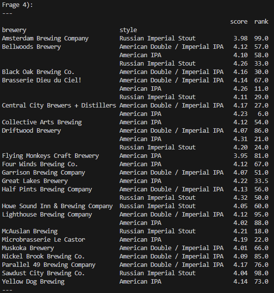
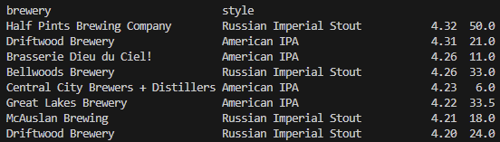

# Auswertung - canadian_beers.csv 

# 1) & 2)
##  Aus welchen Beobachtungen setzen sich die Daten zusammen? Beschreiben Sie diese kurz und überlegen Sie sich, welches Skalenniveau die einzelnen Beobachtungen haben. & Wie setzen sich die einzelnen Beobachtungen zusammen? Verwenden Sie Methoden für univariate Datensätze sinnvoll.

| Variable | Skalenniveau | Methode                             | Beobachtung                                             |
| -------- | ------------ | ----------------------------------- | ------------------------------------------------------- |
| rank     | ordinal      | minimum, maximum, median            | rank, from 1 to 100, as rated by BeerAdvocate.com users |
| name     | nominal      | count                               | name of the beer                                        |
| brewery  | nominal      | count                               | the brewery responsible for this delicious creation     |
| style    | nominal      | count                               | the style of the beer                                   |
| abv      | Verhältnis   | average, mean, minimum, maximum, sd | alcohol by volume (%)                                   |
| score    | Intervall    | average, mean, minimun, maximum, sd | overall score determined by BeerAdvocate.com users      |
| ratings  | Verhältnis   | average, mean, minimum, maximum, sd | number of ratings                                       |

**Skalenniveau**: nominal (keine Rangordnung), ordinal (Rangfolge), Intervall (Gleichheit der Differenzen), Verhältnis (Wohldefinierter Nullpunkt)

# 3)
## Ermitteln Sie Kennzahlen für die einzelnen Beobachtungen, die Ihnen sinnvoll erscheinen. (Lokation, Modus, Varianzen, Quantile…)

 
*Auswertung Frage 3 - Anzahl, Median, Standartabweichung, min-Wert, Quartile (25%, 50% 75%) und max-Wert. Darunter die jeweiligen Varianzen.*

# 4)
## Ermitteln Sie die 3 häufigsten Brauereien und Bier Arten, die in diesem Datensatz vorkommen. Wie verteilen sich Rang und Score auf diese Brauereien und Arten von Bier? Das Bier welcher Brauerei und welcher Art würden Sie jemandem empfehlen, wenn Sie sich nach dem Score richten? (Betrachten Sie hier nur die 3 häufigsten Arten)

 
*Auswertung Frage 4 - Gruppiert nach brewery und style mit den Spalten score und rating*

 
*Auswertung Frage 4 - Ersten acht Biere - zuerst sortiert nach score, dann nach rank*

### Analyse
Das Bier der Brauerei "Central City Brewers + Distillers" mit dem Style "American IPA" hat einen Score von 4.23 und liegt auf Rank 6.

Das Bier der Braueri "Brasserie Dieu du Ciel!" mit dem Style "American IPA" hat einen Score von 4.26 und liegt auf dem Rank 11.

Der Unterschied dieser beiden Biere ist im Vergleich zum ersten Bier in der Liste in Bezug auf den score eher gering. Dem rank nach ist der Unterschied deutlicher zu erkennen (um 44 Plätze schlechter als rank 6). 

### Empfehlung
Eine Empfehlung wäre daher ***entweder*** das "American IPA" der Brauerei "Central City Brewers + Distillers" ODER das "American IPA" der Brauerei "Brasserie Dieu du Ciel!" aufgrund des geringen Unterschiedes zwischen score und rank.

# 5)
## Fügen Sie eine Variable ein, die anzeigt, ob es sich um ein american style beer handelt (Tipp: Variable style). Wie sehen score und rank in diesem Fall aus?

 
*Auswertung Frage 4 - zeigt gruppiert, ob ein Bier "american style" ist, mit den Spalten score und rank*

### Analyse
Die Auswertung zeigt das "american style"-Biere nicht unbedingt besser sind als andere.