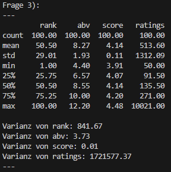
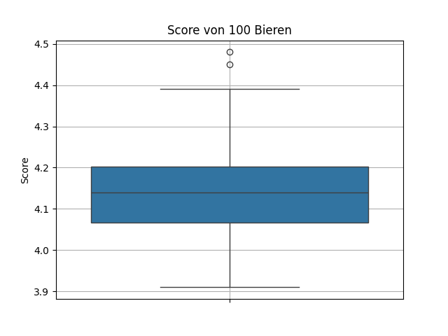
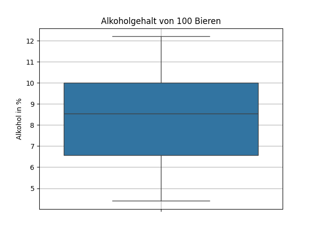
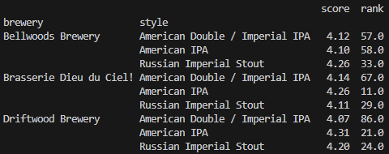
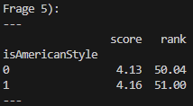

# Auswertung - canadian_beers.csv 

# 1) & 2)
##  Aus welchen Beobachtungen setzen sich die Daten zusammen? Beschreiben Sie diese kurz und überlegen Sie sich, welches Skalenniveau die einzelnen Beobachtungen haben. & Wie setzen sich die einzelnen Beobachtungen zusammen? Verwenden Sie Methoden für univariate Datensätze sinnvoll.

| Variable | Skalenniveau | Methode                             | Beobachtung                                             |
| -------- | ------------ | ----------------------------------- | ------------------------------------------------------- |
| rank     | ordinal      | minimum, maximum, median            | rank, from 1 to 100, as rated by BeerAdvocate.com users |
| name     | nominal      | count                               | name of the beer                                        |
| brewery  | nominal      | count                               | the brewery responsible for this delicious creation     |
| style    | nominal      | count                               | the style of the beer                                   |
| abv      | Verhältnis   | average, mean, minimum, maximum, sd | alcohol by volume (%)                                   |
| score    | Intervall    | average, mean, minimun, maximum, sd | overall score determined by BeerAdvocate.com users      |
| ratings  | Verhältnis   | average, mean, minimum, maximum, sd | number of ratings                                       |

**Skalenniveau**: nominal (keine Rangordnung), ordinal (Rangfolge), Intervall (Gleichheit der Differenzen), Verhältnis (Wohldefinierter Nullpunkt)

# 3)
## Ermitteln Sie Kennzahlen für die einzelnen Beobachtungen, die Ihnen sinnvoll erscheinen. (Lokation, Modus, Varianzen, Quantile…)

 
*Auswertung Frage 3 - Anzahl, Median, Standartabweichung, min-Wert, Quartile (25%, 50% 75%) und max-Wert. Darunter die jeweiligen Varianzen.*

 
*Boxplot - Score von 100 Bieren*

 
*Boxplot - Alkoholgehalt von 100 Bieren*

# 4)
## Ermitteln Sie die 3 häufigsten Brauereien und Bier Arten, die in diesem Datensatz vorkommen. Wie verteilen sich Rang und Score auf diese Brauereien und Arten von Bier? Das Bier welcher Brauerei und welcher Art würden Sie jemandem empfehlen, wenn Sie sich nach dem Score richten? (Betrachten Sie hier nur die 3 häufigsten Arten)

 
*Auswertung Frage 4 - zeigt brewery und style gruppiert, mit Median für score und rank*

 
*Multiplot - Top 3 Rank und Score Auswertung nach Brauereien und Bierarten*

### Analyse
#### Brauereien
Betrachtet man die erste Reihe der Plots, sieht man, dass die Brauerei "Driftwood Brewery" *(blau)* sowohl beim Score als auch bei der Rank-Verteilung *(niedriger Rank ist besser)* besser abschneidet als die beiden anderen.

#### Bierarten
Betrachtet man die zweite Reihe der Plots, sieht man, dass die Bierart "American IPA" *(blau)* sowohl beim Score als auch der Rank-Verteilung deutlich besser abschneidet als die beiden anderen. Die Bierart "American Double / Imperial IPA" *(grün)* schneidet mit Abstand in beiden Kategorien am schlechtesten ab.

### Empfehlung
Wenn man die beiden "Score"-Plots betrachtet, ergibt sich eine eindeutige Empfehlung für die Bierart "American IPA" der Brauerei "Driftwood Brewery", da beide mit Abstand am besten abschneiden.

# 5)
## Fügen Sie eine Variable ein, die anzeigt, ob es sich um ein american style beer handelt (Tipp: Variable style). Wie sehen score und rank in diesem Fall aus?

 
*Auswertung Frage 5 - zeigt gruppiert, ob ein Bier "american style" ist, mit den Spalten score und rank*

 
*Piechart - Verteilung American/Non-American (zeigt nur Verteilung - score und rank nicht einbezogen)*

### Analyse
Die Auswertung zeigt das "american style"-Biere nicht unbedingt besser sind als andere. *(Bezug auf Quelle: Auswertung Frage 5)*

# 6)
## Untersuchen Sie die Unterschiede zwischen ‘Ale’ und ‘Stout’ Bieren.

# 7)
## Wie verhält sich das Ranking in Abhängigkeit vom Score und Alkoholgehalt? Ermitteln Sie, falls passend, den Korrelationskoeffizienten.

# 8)
## Untersuchen Sie den Score in Abhängigkeit der anderen Variablen. Welche Variablen haben Ihrer Meinung nach einen Einfluss?
